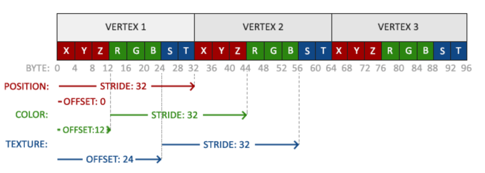
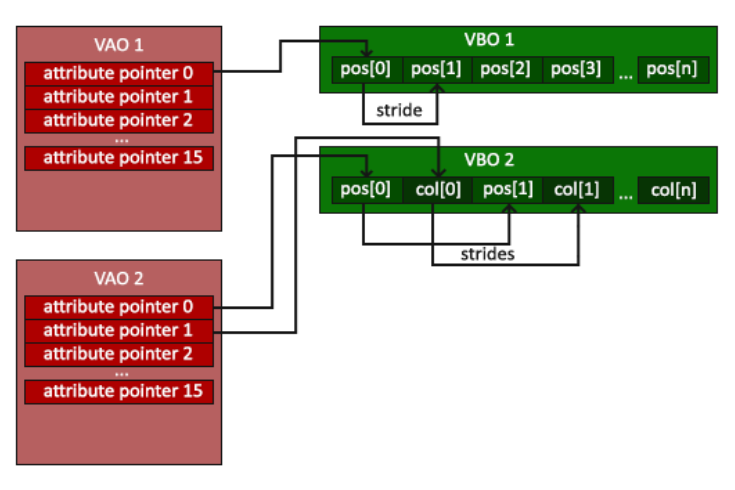
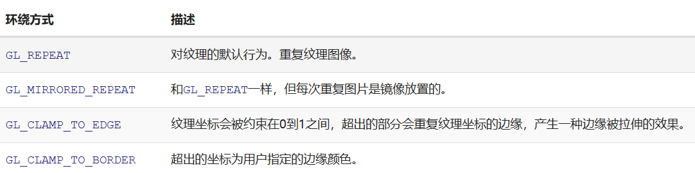
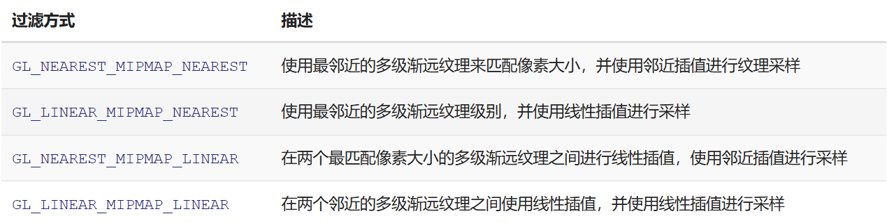
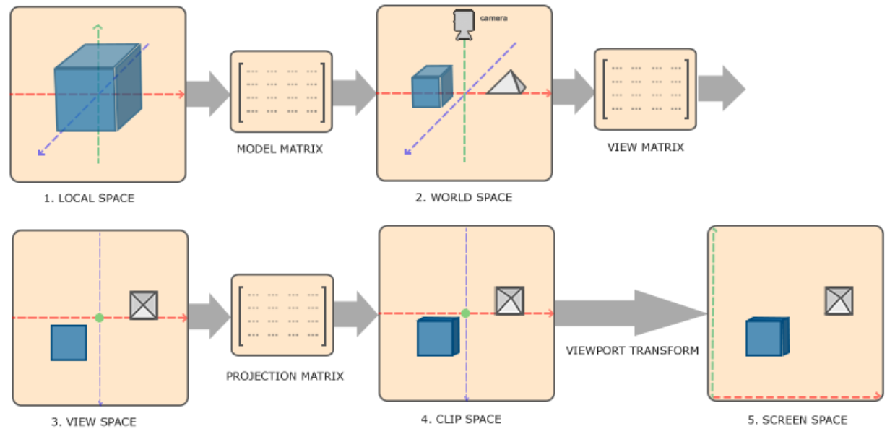
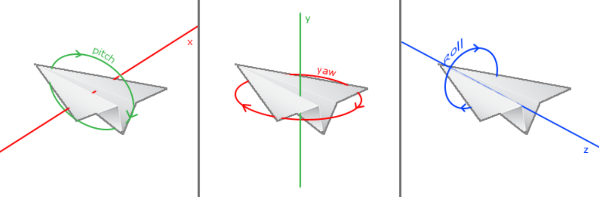
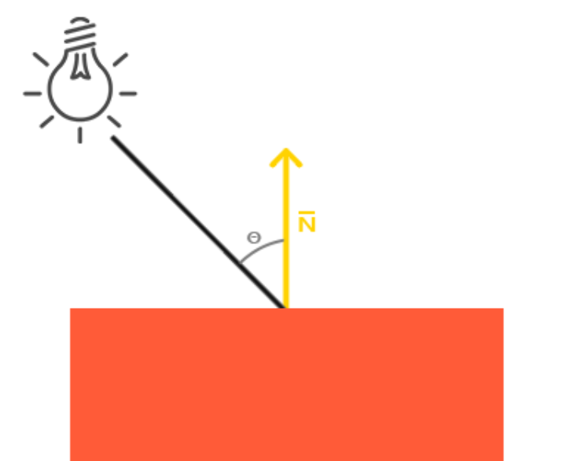
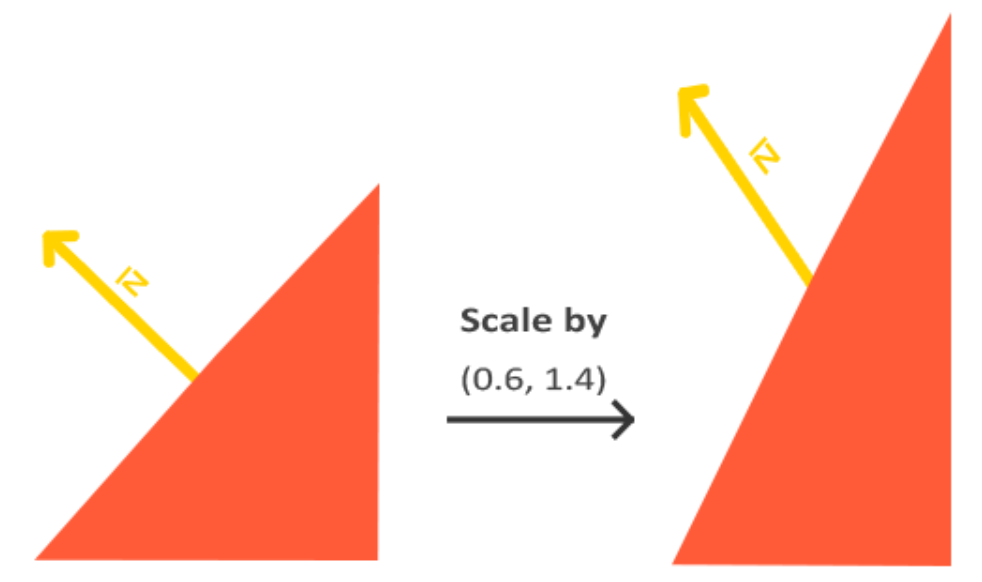
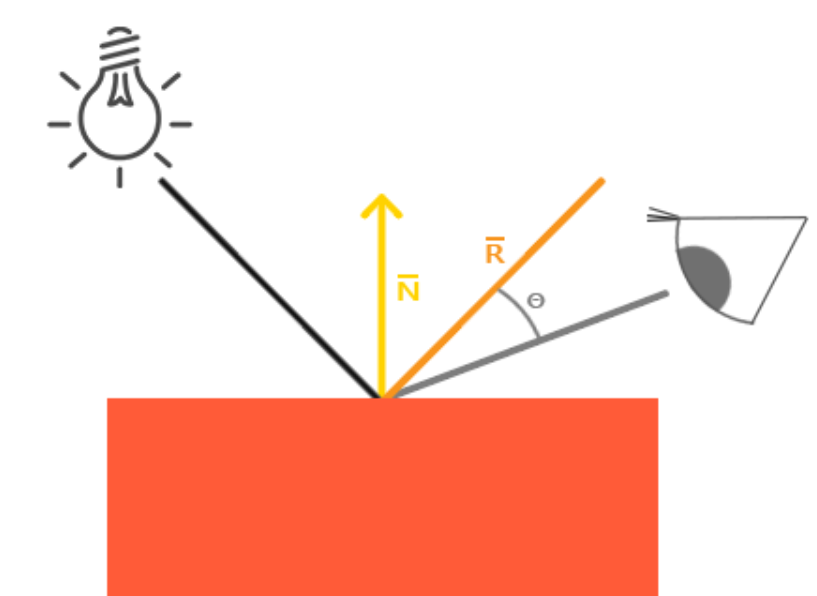

# 注意

在包含glfw头文件之前要先包含glad文件
```
#include <glad/glad.h>  
#include <GLFW/glfw3.h>
```

# 双缓冲
**前缓冲**保存着最终输出的图像
**后缓冲**所有渲染指令都在后缓冲上绘制
所有渲染指令执行完毕后，交换前后缓冲
`glfwSwapBuffers()`


# API

## glclear()
清空屏幕的颜色缓冲
`GL_COLOR_BUFFER_BIT`
`GL_DEPTH_BUFFER_BIT`
`GL_STENCIL_BUFFER_BIT`

# 渲染管线

## 顶点着色器(Vertex Shader)

## 几何着色器(Geometry Shader)
一组顶点 -> 图元(primitive)
```
图元:
`GL_POINTS`
`GL_TRIANGLES`
`GL_LINE_STRIP`
```

## 图元装配(Primitive Assemmbly)
顶点着色器/几何着色器输出的vertex -> 指定图元

## 光栅化(Rasterization)
图元 -> 像素

## 片段着色器(Fragment Shader)
>裁切(Clipping):丢弃超出你的视图以外的所有像素
计算一个像素最终的颜色

## Alpha测试与混合(Blending)


# 标准化设备坐标(Normalized Device Coordinates, NDC)
进行视口变换(Viewport Transform)，标准化设备坐标(Normalized Device Coordinates)会变换为屏幕空间坐标(Screen-space Coordinates)

# 顶点缓冲对象(Vertex Buffer Objects, VBO)
VBO管理储存在显存中的大量Vertex

```
unsigned int VBO;
glGenBuffers(1, &VBO);

//缓冲类型：GL_ARRAY_BUFFER
glBindBuffer(GL_ARRAY_BUFFER, VBO); 

//把数据复制到缓冲中
glBufferData(GL_ARRAY_BUFFER, sizeof(vertices), vertices,GL_STATIC_DRAW);

//GL_STATIC_DRAW ：数据不会或几乎不会改变
//GL_DYNAMIC_DRAW：数据会被改变很多
//GL_STREAM_DRAW ：数据每次绘制时都会改变。

```
一个缓冲中的数据将频繁被改变，那么使用的类型就是GL_DYNAMIC_DRAW或GL_STREAM_DRAW，这样就能确保显卡把数据放在能够高速写入的内存部分。


# 着色器程序(Shader Program)
着色器程序对象(Shader Program Object)是多个着色器合并之后并最终链接完成的版本。

# 链接顶点属性
把顶点信息与顶点着色器相链接

位置数据被储存为32位（4字节）浮点值。
每个位置包含3个这样的值。




```
//顶点属性指针
glVertexAttribPointer(0, 3, GL_FLOAT, GL_FALSE, 3 * sizeof(float), (void*)0);

/* 
0: layout(location = 0)
3: vec3
GL_FLOAT: 数据类型
GL_FALSE: 是否希望数据被标准化到[0, 1]
3 * sizeof(float): 步长(stride)
(void*)0: 位置数据在缓冲中起始位置的偏移量(Offset)

*/

```

# 顶点数组对象(Vertex Array Object, VAO)
可以像VBO一样被绑定，任何随后的顶点属性调用都会储存在这个VAO中，
当配置顶点属性指针时，你只需要将那些调用执行一次，之后再绘制物体的时候只需要绑定相应的VAO。



# 元素缓冲对象(Element Buffer Object，EBO)
当绑定 VAO 后，如果调用了 glBindBuffer(GL_ELEMENT_ARRAY_BUFFER, eboID)，VAO 会记录这个 EBO 的绑定状态。
确保没有在解绑 VAO 之前解绑EBO，否则它就没有这个EBO配置了


# 着色器
`in` 输入
`out` 输出

在顶点着色器中声明了一个vertexColor变量作为vec4输出，并在片段着色器中声明了一个类似的vertexColor。由于它们名字相同且类型相同，片段着色器中的vertexColor就和顶点着色器中的vertexColor链接了

## 顶点着色器
`location` 指定输入一元变量
`layout (location = 0)`
`glGetAttribLocation()`可以查询输入变量

## 片段着色器
需要输出`vec4`

## uniform
表示数据是**global**全局的，可以在任何着色器中定义
注意：如果声明了一个uniform却在GLSL代码中没用过，编译器会静默移除这个变量，导致最后编译出的版本中并不会包含它

`glGetUniformLocation` : 查询位置
`glUniform4f` : 设置uniform值，查询uniform地址不要求你之前使用过着色器程序，但是更新一个uniform之前你必须先使用程序（调用glUseProgram)，因为它是在当前激活的着色器程序中设置uniform的

# 纹理

## 纹理环绕方式


## 纹理过滤(Texture Filtering)
1. GL_NEAREST: 邻近过滤，Nearest Neighbor Filtering
默认纹理过滤方式


2. GL_LINEAR: 线性过滤，(Bi)linear Filtering
基于纹理坐标附近的纹理像素，计算出一个插值，近似出这些纹理像素之间的颜色。


## 多级渐远纹理(Mipmap)


注意：多级渐远纹理主要是使用在纹理被缩小的情况下的：纹理放大不会使用多级渐远纹理，为放大过滤设置多级渐远纹理的选项会产生一个GL_INVALID_ENUM错误代码

## 纹理单元(Texture Unit)
给纹理采样器分配一个位置值，可以让我们能够在一个片段着色器中设置多个纹理。
这样的一个位置值被称为**纹理单元**
一个纹理的默认纹理单元是0，它是默认的激活纹理单元
```
glActiveTexture(GL_TEXTURE0); // 在绑定纹理之前先激活纹理单元
glBindTexture(GL_TEXTURE_2D, texture);
```

# 坐标系统

- 局部空间(Local Space) | 物体空间(Object Space)
物体所在的空间坐标

- 世界空间(World Space)

- 观察空间(View Space)

- 裁剪空间(Clip Space)

- 屏幕空间(Screen Space)



# Z-buffer | 深度缓冲
深度测试(Depth Testing)：当片段想要输出它的颜色时，OpenGL会将它的深度值和z缓冲进行比较，如果当前的片段在其它片段之后，它将会被丢弃，否则将会覆盖。

# 相机

## 欧拉角(Euler Angle)
俯仰角(Pitch)、偏航角(Yaw)和滚转角(Roll)


# 布林冯光照模型(Blinn-phong model)

## 环境(Ambient)

## 漫反射(Diffuse)



### 法线矩阵(Normal Matrix)
由于法向量是一个方向向量，当物体应用model矩阵后，法向量会发生改变，其值不等于原法向量乘model

法线矩阵被定义为「模型矩阵左上角3x3部分的逆矩阵的转置矩阵」

```
Normal = mat3(transpose(inverse(model))) * aNormal;
```
求解推导：[法线矩阵推导](https://zhuanlan.zhihu.com/p/477868547)
推导的核心要点在于，平面的切向量$\vec{T} \cdot {\vec{N}} = 0$，且$\vec{T}$乘model矩阵后方向不变

注意：矩阵求逆是一项对于着色器开销很大的运算，因为它必须在场景中的每一个顶点上进行，所以应该尽可能地避免在着色器中进行求逆运算。最好先在CPU上计算出法线矩阵，再通过uniform把它传递给着色器


## 镜面(Specular)
强度取决于光线镜面反射角度与视线角度，为例简化计算通常使用半程向量与法线的点乘


反光度(Shininess)
一个物体的反光度越高，反射光的能力越强，散射得越少，高光点就会越小。
```
float spec = pow(max(dot(viewDir, reflect), 0.0), shininess);
```


