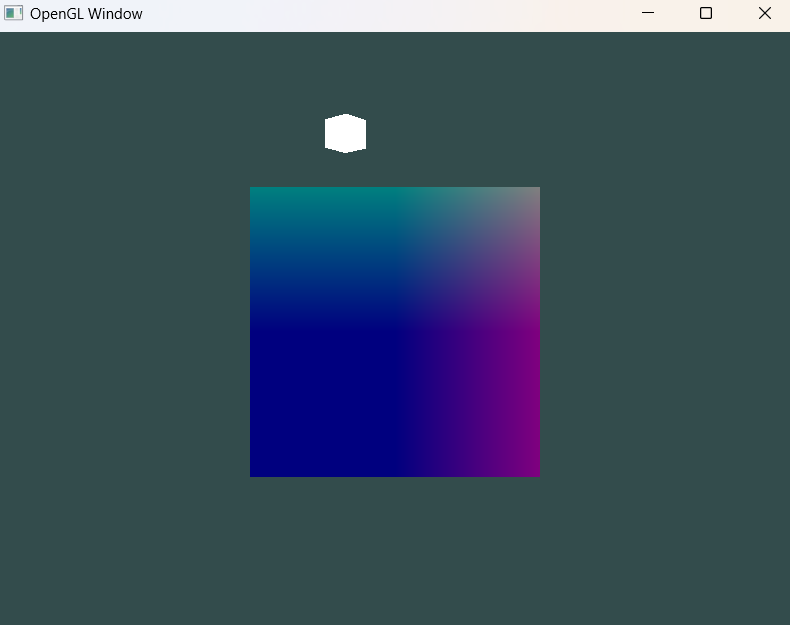
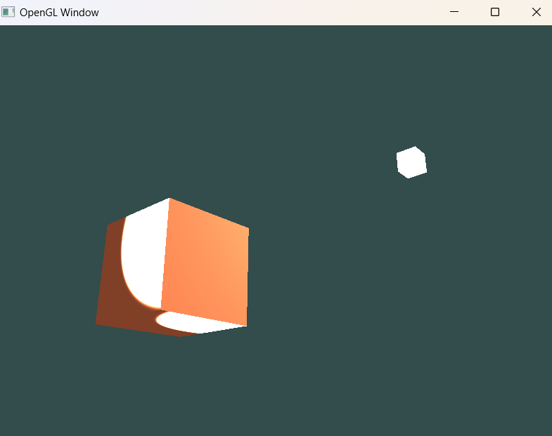
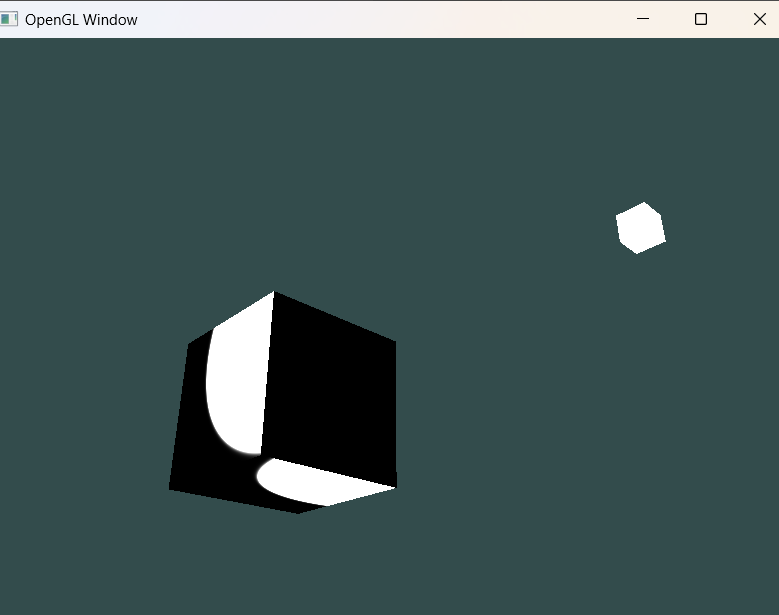
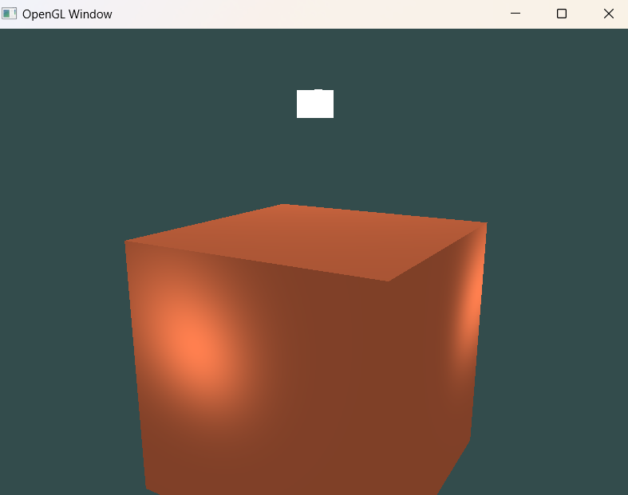

# 环境配置
## 安装glfw
由于预编译文件与本地编译器产生了不兼容的问题，本项目自己编译glfw
1. 源码下载
2. `makedir build` -> `cd build` -> `cmake .. -G "MinGW Makefiles"` -> `mingw32-make`
3. `build/src/libglfw.a`复制到项目路径下

# 问题

## 设置uniform之前检查是否glUseProgram()

问题描述：
转动相机白色物体移动，彩色物体始终是二维平面
且交换两个shader画三角形的逻辑后，bug消失

解决：
最后发现是因为，控制彩色物体的uniform变量赋值之前把glUserProgram()写在了循环外面，
所以第二次进入循环时，uniform变量赋值之前没有glUserProgram()
所以，交换两个shader渲染的顺序问题会消失

## 光照信息计算时记得归一化向量

问题描述：
加上镜面反射后，出现了如下情况

把光照信息当作颜色赋给物体：

解决：
计算反射光线时忘记把传入的向量归一化

## 

问题描述：

镜面反射方向不对,且镜头移动时高光没产生变化

解决：
把viewerPos信息当作颜色渲染在物体上，法线viewerPos始终是(0, 0, 0)
发现设置uniform的时候把变量名打错了